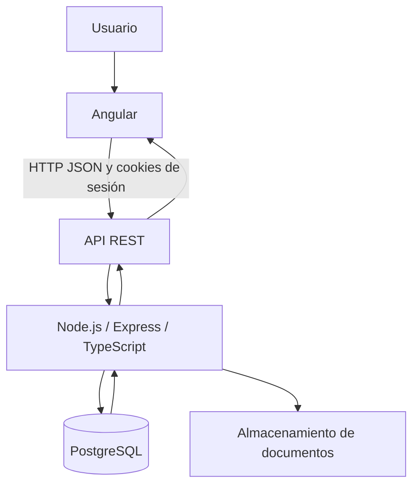

# Arquitectura general

**Actualizado:** 23 de septiembre de 2026
**Tipo:** técnico y funcional

## Recorrido principal



El usuario opera el frontend Angular. Angular consume la API bajo `/api/v1`; en desarrollo puede usar `http://localhost:3000/api/v1` o el proxy LAN. El backend Express valida la sesión y la entrada, ejecuta reglas de negocio y consulta PostgreSQL. Los documentos de cotización y facturas se almacenan en el directorio configurado por `DOCUMENT_STORAGE_PATH`, mientras sus metadatos se guardan en PostgreSQL.

## Capas del backend

```text
Route
  → Controller
    → Service
      → Repository
        → PostgreSQL
```

- **Route:** declara método, ruta y middleware específico, por ejemplo `requireRole`.
- **Controller:** convierte parámetros, query y body a tipos válidos; decide el código HTTP.
- **Service:** aplica reglas de negocio, coordina transacciones y construye la respuesta de dominio.
- **Repository:** ejecuta SQL parametrizado y transforma filas.
- **PostgreSQL:** conserva relaciones, restricciones, índices, códigos, historial y auditoría.

## Áreas funcionales

- Inventario: dispositivos, tipos, familias de códigos, estados y valores comerciales.
- Organización: departamentos, dependencias y colaboradores.
- Telefonía: SIM, línea móvil y relación opcional con smartphones.
- Custodia: colaborador, departamento o ninguno, con vigencia temporal.
- Trazabilidad: historial de eventos, verificaciones físicas y auditoría de mutaciones.
- Documentos: facturas, cotizaciones, actas, comprobantes y PDF generados.
- Operación: dashboard, alertas de stock, reportes y offboarding.
- Servicio técnico: orden, diagnóstico, cotización, decisión, retorno y equipo temporal.

## Principios

1. El código ITAM se genera en backend y permanece inmutable.
2. La custodia vigente es única por dispositivo.
3. Los cambios relevantes dejan historial; la auditoría transversal registra mutaciones HTTP.
4. Los estados terminales y las bajas no se sustituyen por cambios genéricos.
5. La evidencia histórica se separa de la situación operacional actual.
