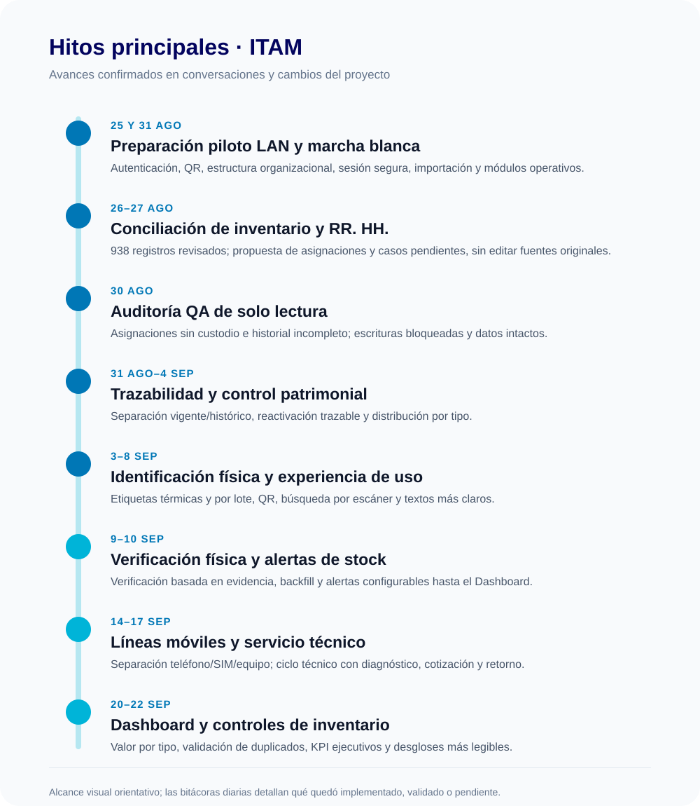
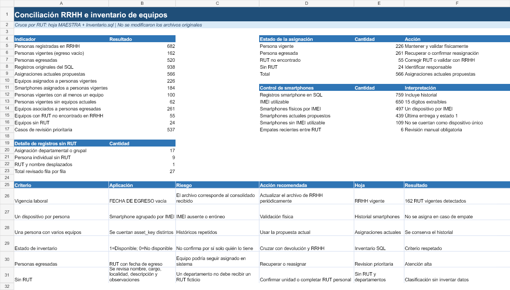
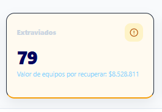

# Bitácora detallada de trabajo ITAM

**Período:** lunes 24 de agosto a martes 22 de septiembre de 2026
**Última bitácora previa:** viernes 21 de agosto de 2026

**Tipo:** operativo e histórico
**Actualizada como fuente de detalle:** 23 de septiembre de 2026

Esta bitácora consolida las conversaciones de trabajo de ITAM disponibles para el período y las contrasta con el historial versionado. De los 22 días hábiles comprendidos entre el 24 de agosto y el 22 de septiembre, hay evidencia de actividad en 17; los otros cinco quedan explícitamente pendientes de confirmar y no se rellenan por inferencia. Los cambios de código y las validaciones se distinguen de los análisis, tareas interrumpidas y actividades cuyo despliegue no fue confirmado.

## Resumen ejecutivo

Durante el período se avanzó desde la preparación del piloto LAN y la conciliación de inventario con Recursos Humanos hasta la formalización de líneas móviles, el flujo de Servicio Técnico y la reorganización ejecutiva del Dashboard. Los hitos con mayor impacto fueron la propuesta de conciliación basada en 938 registros SQL; la incorporación de verificación física y alertas de reposición; la separación entre smartphone, SIM y número telefónico; y la presentación del histórico patrimonial y de la operación en el Dashboard.

La evidencia combina commits, resultados de pruebas reportados en las tareas y artefactos visuales. Una auditoría de QA del 30 de agosto quedó en diagnóstico de solo lectura porque el entorno no aceptó escrituras. Una solicitud visual del formulario de entrega del 9 de septiembre quedó interrumpida y no se registra como completada. El push solicitado el 17 de septiembre tampoco se ejecutó. Cinco días hábiles no tienen registro suficiente para describir actividad.

## Hitos del período

1. **Piloto LAN y marcha blanca (25 y 31 de agosto):** autenticación, QR, estructura organizacional, control de sesión, importación y consolidación de módulos y pruebas.
2. **Conciliación de inventario con RR. HH. (26–27 de agosto):** cruce de 938 registros, revisión de asignaciones y clasificación de casos sin editar las fuentes. Resultado central: 162 personas vigentes, 226 equipos asociados a ellas y 537 casos de revisión prioritaria.
3. **Auditoría QA de solo lectura (30 de agosto):** análisis de integridad y trazabilidad; se confirmaron asignaciones históricas que no aparecían en el historial de colaboradores y equipos asignados sin custodio. Se intentó continuar la corrección, pero el entorno rechazó escrituras; no se alteraron datos ni migraciones.
4. **Trazabilidad patrimonial (1–4 de septiembre):** separación de inventario vigente e histórico, avisos de custodia, recuperación/reactivación trazable, distribución por tipo y criterios más claros del Dashboard.
5. **Etiquetas y operación de inventario (3–8 de septiembre):** impresión de etiquetas térmicas y por lote, QR real, búsqueda por escáner, etiquetas SIM y continuidad visual desde el registro del activo.
6. **Verificación física y reposición (9–10 de septiembre):** verificación basada en evidencia, migraciones y backfill; configuración de alertas de stock integrada desde backend hasta Dashboard.
7. **Línea móvil separada de la SIM (14–15 de septiembre):** línea telefónica como entidad independiente; flujo para registrar/corregir el número, permitir línea sin SIM y conservar verificación física como acción separada.
8. **Servicio técnico y documentación (15–17 de septiembre):** flujo por etapas, diagnóstico/cotización, adjuntos y PDF de orden de trabajo, cierre/retorno; ajustes de actas y reversión de una corrección que afectó su generación.
9. **Dashboard, inventario y validaciones (20–22 de septiembre):** valor económico del inventario activo por tipo, validación de IMEI/serie duplicados, mejoras visuales ejecutivas y desglose económico del histórico.

| Fecha | Hito | Resultado que queda registrado |
| --- | --- | --- |
| 25 ago | Piloto LAN | Base de autenticación, QR, estructura de usuarios y parámetros de ejecución para red local. |
| 27 ago | Conciliación | Propuesta con datos de RR. HH., inventario y telefonía; originales preservados y excepciones marcadas para revisión. |
| 30 ago | Auditoría QA | Hallazgos priorizados en modo de solo lectura; correcciones no aplicadas por bloqueo de escritura. |
| 1–10 sep | Trazabilidad y control físico | Historial, verificación física, etiquetas y alertas de reposición conectadas al Dashboard. |
| 14–15 sep | Línea móvil | Número telefónico separado de la SIM y del smartphone; guardado sin SIM y refresco de la ficha. |
| 15–17 sep | Servicio Técnico y actas | Flujo por etapas, diagnóstico, cotizaciones, cierre, migraciones y corrección de departamento en actas. |
| 20–21 sep | Inventario y etiqueta | Valor activo por tipo, validación de IMEI/serie y ajuste de impresión física 60 × 38 mm. |
| 22 sep | Dashboard gerencial | Jerarquía de KPI, Control Físico, histórico económico por tipo y preparación de presentación ejecutiva. |

## Bitácora diaria

### Lunes 24 de agosto
**Actividad registrada:** No se encontró evidencia en los commits ni en las tareas consultadas para este día.
**Resultado / hito:** Pendiente de completar con registro personal, si hubo trabajo fuera del repositorio.

### Martes 25 de agosto
**Preparación para el piloto LAN de ITAM.** Se trabajó en:
- configuración de autenticación y servicios de backend para el despliegue en red local;
- lectura y soporte de códigos QR en la aplicación;
- estructura organizacional y datos relacionados con colaboradores y departamentos;
- módulos de usuarios, reportes, documentos y flujos de inventario;
- importación de inventario y mejoras de tipos, contratos y persistencia;
- certificados y parámetros de ejecución para el acceso LAN.

**Resultado / hito:** avance base de la versión destinada a piloto, respaldado por cambios de frontend, backend y migraciones.

### Miércoles 26 de agosto
**Inicio de conciliación de inventario y telefonía.** Se revisaron fuentes de equipos y líneas activas y se definió una conciliación sin modificar los originales. Los criterios incluyeron código interno, teléfono, ICCID/SIM, IMEI, colaborador, RUT, estado y localidad.

Se establecieron categorías para identificar coincidencias confirmadas o probables, equipos presentes en una sola fuente, duplicados e inconsistencias que requieren revisión manual. También se acordó interpretar el estado de inventario con el criterio entregado por la usuaria.

**Resultado / hito:** definición del método de análisis y clasificación; la conciliación de archivos pertenece a una tarea de análisis separada del repositorio ITAM.

### Jueves 27 de agosto
**Conciliación de inventario con RR. HH. y telefonía.** Se trabajó con hojas de inventario y líneas activas, y posteriormente con el SQL y la hoja maestra de trabajadores. Se revisaron identificadores como RUT, IMEI, teléfono, SIM, estado, cargo, localidad y departamento. Se interpretó “fecha de egreso vacía” como trabajador vigente y `inventario_equipos_estado = 1` como disponible; esos criterios se conservaron en el análisis.

Resultados comunicados en la conversación:
- 162 personas vigentes; 100 con equipos y 62 sin equipos;
- 226 equipos asociados a personas vigentes, incluidos 184 smartphones;
- 261 equipos aún asociados a personas egresadas;
- 55 equipos con RUT no encontrado y 24 sin RUT;
- 439 smartphones actuales propuestos según IMEI y última entrega; 109 sin IMEI utilizable y 6 empates entre RUT que requieren revisión.

En la revisión de registros sin RUT válido, se detectaron filas que representaban departamentos/grupos y otras que eran personas con RUT pendiente; se dejó explícito no completar información por suposición. Se generó una propuesta de conciliación en Excel con resumen, asignaciones actuales, RR. HH. vigente/egresado, revisión prioritaria, historial de smartphones, fuente SQL y reglas. Los archivos originales no se modificaron.

**Resultado / hito:** propuesta de inventario conciliado y clasificación de riesgos para validación humana. La imagen muestra el resumen agregado del análisis, no una modificación de ITAM.

*Evidencia: vista de resumen del Excel de conciliación producido durante la conversación del 27 de agosto.*

### Viernes 28 de agosto
**Actividad registrada:** No se encontró evidencia fechada para este día en el historial consultado.
**Resultado / hito:** pendiente de completar con antecedentes adicionales, si corresponde.

### Lunes 31 de agosto
**Consolidación de ITAM para marcha blanca.** La integración incluyó:
- autenticación, autorización y contexto del usuario autenticado;
- gestión de sesión y vencimiento por inactividad;
- procesos de offboarding, devolución y recuperación de equipos;
- mejoras en inventario, colaboradores, SIM y servicio técnico;
- preparación de importadores para inventario real y conciliado;
- migraciones de base de datos y documentación de API;
- pruebas de integración para autenticación, custodia, offboarding y Dashboard.

**Resultado / hito:** consolidación funcional para marcha blanca, con cambios coordinados en backend, frontend, base de datos y pruebas.

### Martes 1 de septiembre
**Trazabilidad de colaboradores, custodias y lectura del inventario.** Se trabajó en:
- separar equipos actuales de equipos históricos en la vista del colaborador;
- mejorar la consulta del historial de equipos y la normalización del RUT;
- identificar inconsistencias de asignación y mejorar datos usados en conciliación;
- aclarar en el Dashboard el alcance del inventario actual y las alertas de custodia;
- mejorar la presentación de estados en ficha y listado de dispositivos.

**Resultado / hito:** mayor claridad sobre quién mantiene actualmente un equipo y qué registros son históricos; se añadieron pruebas y ajustes de soporte.

### Miércoles 2 de septiembre
**Actividad registrada:** No se encontró evidencia en el historial consultado para esta fecha.
**Resultado / hito:** pendiente de agregar si existieron pruebas manuales, reuniones o trabajo no reflejado en Git.

### Jueves 3 de septiembre
**Correcciones de inventario, Dashboard y etiquetas.** Se registraron varios avances:
- diferenciar equipos operativos actuales de registros históricos en los indicadores;
- corregir inconsistencias y redundancias en los cálculos y textos del Dashboard;
- agregar impresión de etiquetas por lote y vista previa independiente;
- ajustar el tamaño de etiqueta térmica y generar códigos QR reales;
- mejorar mensajes de conflicto al crear o cambiar el estado de un activo;
- habilitar la reactivación de equipos recuperados manteniendo trazabilidad.

**Resultado / hito:** mejora transversal de lectura patrimonial y de la identificación física de equipos; se incorporaron pruebas para los flujos corregidos.

### Viernes 4 de septiembre
**Distribución activa y herramientas de operación.** Se trabajó en:
- mostrar la distribución del inventario activo por tipo en el Dashboard;
- ajustar la búsqueda del escáner para que el código leído funcione como criterio de búsqueda del activo;
- permitir impresión por lote de etiquetas para líneas/SIM.

**Resultado / hito:** el Dashboard comenzó a distinguir mejor la distribución vigente y se mejoraron tareas de identificación para inventario y telefonía.

### Lunes 7 de septiembre
**Normalización de textos y presentación.** Se simplificó el lenguaje de la interfaz en dispositivos, colaboradores, actas y offboarding. También se estandarizaron términos y capitalización, se alineó la etiqueta de ficha con el diseño de impresión y se corrigieron denominaciones visibles en navegación.

**Resultado / hito:** vocabulario más uniforme y comprensible para usuarios administrativos, con ajustes en diferentes vistas del sistema.

### Martes 8 de septiembre
**Simplificación del flujo técnico y mejoras de trazabilidad.** Se trabajó en:
- reorganizar la pantalla de revisión técnica y simplificar sus textos;
- aclarar columnas y datos del historial de equipos de colaboradores;
- completar el diálogo de etiqueta posterior al registro de un dispositivo;
- mostrar la etiqueta completa tras finalizar el registro;
- actualizar rutas, pruebas y documentación de avance relacionadas con trazabilidad.

**Resultado / hito:** flujo de revisión técnica más fácil de seguir y mejor continuidad entre el alta del activo, su etiqueta y su historial.

### Miércoles 9 de septiembre
**Verificación física de equipos basada en evidencia.** Se implementó y ajustó:
- registro de resultados de verificación y consulta de evidencia física;
- integración de la verificación con los datos y estados de dispositivos;
- pruebas de servicio y persistencia;
- migraciones para mantener la secuencia de esquema y la nueva funcionalidad;
- backfill para completar verificaciones derivadas de evidencia operacional existente.

**Resultado / hito:** incorporación del proceso de verificación física al sistema con soporte de base de datos, pruebas y tratamiento de registros anteriores.

**Solicitud paralela que quedó pendiente:** en otro hilo se pidió pulir visualmente el buscador de colaboradores del formulario “Registrar entrega”, trabajando sobre la copia ubicada en `D:` y sin tocar la copia de `E:`. La tarea se interrumpió y no dejó una confirmación de que el ajuste visual se completara ni de que se publicara. Se registra como pendiente, separada de la verificación física que sí tuvo cambios versionados.

### Jueves 10 de septiembre
**Alertas configurables de reposición de stock.** Se incorporaron:
- reglas y persistencia para definir umbrales de alerta por tipo de dispositivo;
- endpoints y servicios para consultar y administrar configuraciones;
- pantalla frontend de gestión de alertas;
- integración de alertas activas con el Dashboard;
- migraciones y pruebas automatizadas del flujo.

También se ajustaron servicios de dispositivos, formularios y soporte para instalación local.

**Resultado / hito:** disponibilidad del flujo de alertas de reposición desde configuración hasta visualización operativa.

### Viernes 11 de septiembre
**Actividad registrada:** No se encontró evidencia fechada en Git para este día.
**Resultado / hito:** pendiente de completar con tareas de validación o coordinación realizadas fuera del repositorio.

### Lunes 14 de septiembre
**Separación formal de smartphone, SIM física y línea telefónica.** Se incorporó el módulo `lineas_moviles` como entidad de la línea, manteniendo SIM y dispositivo como elementos distintos. El cambio incluyó migración 028 y rollback, migración de números heredados, relación de SIM con línea, repositorio/servicio/controladores y adaptación de modelos y pantallas.

La conversación identificó y corrigió además el problema de lectura/refresco de una línea directa sin SIM: la ficha debe consultar primero línea de la SIM, luego línea directa del dispositivo y finalmente el dato legado. Se simplificó el control para gestionar la línea y la SIM, permitir corregir el número y dejar historial de cambios con número anterior/nuevo, activo y usuario.

**Resultado / hito:** formalización del modelo de telefonía móvil para evitar confundir el número telefónico con la tarjeta SIM física. La validación de usuario dejó claro que el flujo inicial aún tenía restricciones; esas reglas se refinan en las conversaciones del 15 de septiembre.

### Martes 15 de septiembre
**Gestión de líneas móviles y simplificación de servicio técnico.** Se trabajó en dos frentes:
- estabilizar asignación y gestión de líneas móviles asociadas a smartphones;
- actualizar servicios, contratos y controladores para manejar datos de línea y relaciones con dispositivos;
- auditar y corregir verificaciones automáticas, además de reforzar el backfill basado en evidencia;
- simplificar el flujo de servicio técnico y reducir complejidad de la pantalla;
- ajustar ficha de dispositivo, modelos y pruebas asociadas a revisión técnica y smartphones.

**Resultado / hito:** avance integrado entre telefonía móvil, inventario de smartphones y servicio técnico, con migración y pruebas de soporte.

**Detalle adicional de la jornada:** se corrigió un guardado de línea que, según la evidencia de Network aportada por la usuaria, no estaba enviando el `POST` esperado. Se enlazó el submit real del formulario, se usó el código del dispositivo abierto y se añadió confirmación posterior por `GET` antes de mostrar éxito. La SIM pasó a ser opcional para registrar una línea; el guardado no marca el equipo como verificado. La regla quedó explícita: registrar o corregir una línea no exige ni concede verificación física. Se probaron smartphones de códigos distintos y se restauraron los datos de validación para no dejar registros ficticios.

En servicio técnico, se redujo la pantalla a etapas de envío, diagnóstico/cotización y retorno/cierre. El PDF se formalizó como orden de trabajo, se impidió duplicar revisiones activas y se mostró el estado técnico en la ficha.

### Miércoles 16 de septiembre
**Implementación y corrección del ciclo de Servicio Técnico.** Se desarrollaron diagnóstico, cotizaciones y cierre/retorno en varios pasos. Durante las pruebas aparecieron errores reales de esquema: faltaban campos usados para guardar la revisión (`area_solicitante`, `contacto_servicio`, `plazo_informado`) y luego campos de retorno (`estado_final`, `observaciones_retorno`). Se añadieron las migraciones 030 y 031, control de estados y validaciones de fechas/costos.

Se corrigieron respuestas HTTP y mensajes visibles del frontend para diagnóstico, cotización y cierre. La orden 61 se usó para verificar la transición a cotización recibida y luego sus datos originales se restauraron. Continuó la funcionalidad de cotizaciones versionadas con adjuntos, ticket del proveedor, observaciones, costo cotizado y costo final.

**Resultado / hito:** el flujo pudo persistir datos de revisión/cierre con el esquema requerido; se añadió evidencia de integración y se preparó migración de soporte para cotizaciones.

### Jueves 17 de septiembre
**Consolidación del flujo de servicio técnico y ajustes de actas.** Se completaron cambios en:
- ciclo de revisión técnica, diagnóstico, cotización y cierre/retorno de equipos;
- carga de archivos de respaldo y datos necesarios en órdenes de trabajo;
- persistencia, rutas, modelos y validaciones de backend;
- actualización del frontend y de la información mostrada en la ficha del activo;
- simplificación del estado de verificación en el detalle del dispositivo;
- resolución de la consulta del departamento real que debe mostrarse en actas de entrega.

**Resultado / hito:** avance amplio del ciclo de servicio técnico con pruebas y migraciones; se corrigió además la información organizacional presentada en actas.

Durante el día se corrigió la obtención del departamento en la vista previa y PDF de actas. La primera implementación se revirtió cuando la usuaria informó que dejó de generar las actas; después se aplicó una corrección alternativa y se validó una acta real (`AE-2026-000073`, departamento Administración y Finanzas). También se simplificó la expresión de estado de verificación en la ficha del dispositivo.

Se guardó el avance de Servicio Técnico y verificación en el commit `3a17a8e` (35 archivos; 860 líneas agregadas y 183 eliminadas). Se solicitó un push, pero quedó pendiente de confirmación de seguridad para subir a `main`; la conversación confirma que no se realizó.

### Viernes 18 de septiembre
**Actividad registrada:** No se encontró evidencia fechada en Git para este día.
**Resultado / hito:** pendiente de completar si se realizaron pruebas de aceptación o revisión de los cambios del 17 de septiembre.

### Lunes 21 de septiembre
**Ajustes de API, ficha de dispositivo, Dashboard y etiqueta térmica.** En las conversaciones se registró:
- alineación de backend, entorno frontend y proxy LAN con la API en el puerto 3000; se confirmó respuesta de health y conexión PostgreSQL `itam_dev`;
- mejora visual de la ficha del dispositivo con indicadores de resumen e historial de servicio técnico;
- adición del valor económico del inventario activo real y desglose por tipo, excluyendo bajas y extraviados e incluyendo estados operativos aplicables;
- corrección del layout de etiqueta física 60 × 38 mm para centrar y reducir la composición manteniendo QR, contenido y negro sobre blanco;
- inicio de reorganización ejecutiva del Dashboard, luego puesto en pausa a petición de la usuaria.

**Resultado / hito:** conexiones de desarrollo alineadas y avance de presentación de ficha, etiqueta y Dashboard. Las confirmaciones de puerto y health corresponden al entorno local; no se registró despliegue remoto.

### Martes 22 de septiembre
**Mejoras ejecutivas de la zona superior y de los desgloses del Dashboard.** Se trabajó en:
- separar visualmente los KPI en indicadores gerenciales principales y estado operacional;
- ordenar y uniformar accesos directos a Servicio Técnico, Actas, Offboarding y Reportes;
- mejorar contraste del indicador de equipos extraviados para que la alerta sea más visible;
- convertir el bloque de Control Físico en una tabla vertical con tipo, detalle y participaciones de cantidad y valor;
- mantener los valores y porcentajes conectados a los datos existentes, sin introducir cifras fijas;
- presentar el histórico por tipo con encabezados claros y mostrar la inversión por tipo al desplegar el detalle.

**Resultado / hito:** mejora de lectura ejecutiva del Dashboard y de la comprensión de los desgloses para usuarios administrativos. Se validó la compilación Angular y las pruebas del frontend finalizaron con 77 aprobadas.

En el desglose histórico también se completó el valor acumulado real por tipo desde `valor_comercial`, agrupado en el backend incluyendo registros de todos los estados; la tarjeta muestra esa columna solo cuando se despliega la inversión. La suma total y el desglose respetan los valores del sistema. La prueba final del frontend fue 77/77 y el typecheck backend pasó. El build de producción no concluyó por el presupuesto CSS de `dashboard.scss`: 13,02 KB frente al máximo configurado de 10 KB; no fue un error de plantilla ni de TypeScript.

La captura incluida fue la referencia recibida antes de aumentar el contraste de “Extraviados”; no se presenta como captura posterior al cambio.

**Presentación ejecutiva:** en la conversación de ese día se preparó una presentación editable de 14 diapositivas orientada a personas de administración, sin tecnicismos. La secuencia cubre el problema inicial, análisis y decisiones, propósito de ITAM, ciclo de vida, funciones, identificación física, verificación, inventario actual frente a histórico, entregas/Servicio Técnico/offboarding, Dashboard, beneficios y expectativas. Se añadieron notas breves para exponer. La usuaria pidió denominar el sistema simplemente “ITAM”, preferencia respetada en esta bitácora.

*Evidencia: captura compartida por la usuaria el 22 de septiembre; motivó el ajuste de contraste del título, cifra, borde e icono.*

## Actividad de fin de semana relacionada (fuera de la bitácora lunes–viernes)

### Domingo 30 de agosto
**Auditoría QA de solo lectura.** Se revisaron hallazgos de integridad y trazabilidad con consultas de lectura y revisión de código. Entre los casos confirmados estaban los equipos 7001, 7002 y 7003 en estado asignado sin persona/departamento, y 381 eventos de asignación histórica con una clave que la consulta del historial no reconocía. Se detectaron también riesgos de concurrencia y de cierre de servicio técnico.

La corrección P1 no pudo aplicarse porque el entorno devolvía errores de preparación/escritura. Se verificó que no cambiaron archivos ni datos, que las migraciones 001–022 conservaron sus hashes y que no hubo importación, commit o push como parte de esa auditoría.

**Resultado / hito:** diagnóstico priorizado sin cambios destructivos; los equipos y la base de datos quedaron intactos.

### Domingo 20 de septiembre
Las conversaciones registran trabajo que sirve de contexto para el lunes siguiente: agregar el valor económico del inventario activo real al Dashboard; validar IMEI y número de serie en tiempo real para prevenir duplicados, con endpoint de validación y exclusión del propio dispositivo al editar; y mejorar la ficha del dispositivo con indicadores e historial de servicio técnico. Se conserva aquí como anexo porque ocurrió en domingo, fuera del período diario solicitado de lunes a viernes.

## Referencias de cambios versionados

Los commits permiten rastrear una parte de los hitos técnicos descritos arriba:

- **25 ago:** `d5a31d1` — preparación de ITAM para piloto LAN.
- **31 ago:** `d2760b6` — consolidación para marcha blanca.
- **1 sep:** `210eed2`, `e677ade`, `bfb2cc4` — historia de equipos, RUT, custodia e inventario.
- **3–4 sep:** `b4fcb31`, `4133113`, `e1f8334`, `7cf0c06`, `835e2c2`, `a82b10b`, `674a9f6` — correcciones de Dashboard, etiquetas y búsqueda.
- **7–10 sep:** `0f0c556`, `4a55836`, `9284ff1`, `fd00d89`, `35344c6`, `53796dd`, `472c55f`, `85ee1f6` — lenguaje, servicio técnico, verificación y alertas.
- **15 sep:** `f478754`, `80358fa` — líneas móviles y operación de servicio técnico.
- **17 sep:** `3a17a8e`, `3a4fea5`, `8df7f28`, `bb1abb4`, `dde7662` — flujo técnico, verificación y secuencia de correcciones/reversión de actas.

Las tareas del 14 y 20–22 de septiembre incluyen cambios trabajados en el árbol local y evidencias conversacionales; no todos cuentan con un commit fechado en esas jornadas.

## Fechas que requieren confirmación

No apareció actividad verificable en el registro consultado para: lunes 24 y viernes 28 de agosto; miércoles 2 y viernes 11 de septiembre; y viernes 18 de septiembre. El 16 sí cuenta con evidencia de conversaciones sobre Servicio Técnico, por lo que está detallado arriba aunque no se encontraron commits ese día. Si hubo trabajo adicional fuera de Git o Codex, puede agregarse con el detalle correspondiente.
