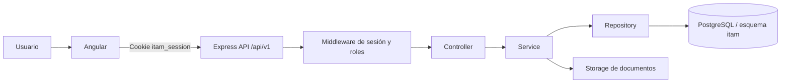

# Diagrama de arquitectura general

**Actualizado:** 23 de septiembre de 2026
**Tipo:** técnico

```mermaid
flowchart LR
    U[Usuario] --> FE[Angular]
    FE -->|Cookie itam_session| API[Express API /api/v1]
    API --> AUTH[Middleware de sesión y roles]
    AUTH --> C[Controller]
    C --> S[Service]
    S --> R[Repository]
    R --> DB[(PostgreSQL / esquema itam)]
    S --> DOC[Storage de documentos]
```
