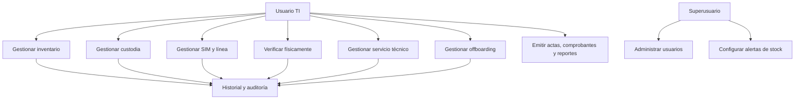

# Casos de uso

**Actualizado:** 23 de septiembre de 2026
**Tipo:** funcional

```mermaid
flowchart TB
    TI[Usuario TI] --> INV[Gestionar inventario]
    TI --> CUS[Gestionar custodia]
    TI --> TEL[Gestionar SIM y línea]
    TI --> VER[Verificar físicamente]
    TI --> ST[Gestionar servicio técnico]
    TI --> OFF[Gestionar offboarding]
    TI --> DOC[Emitir actas, comprobantes y reportes]
    SUP[Superusuario] --> ADM[Administrar usuarios]
    SUP --> ALERT[Configurar alertas de stock]
    INV --> HIST[Historial y auditoría]
    CUS --> HIST
    TEL --> HIST
    VER --> HIST
    ST --> HIST
    OFF --> HIST
```
