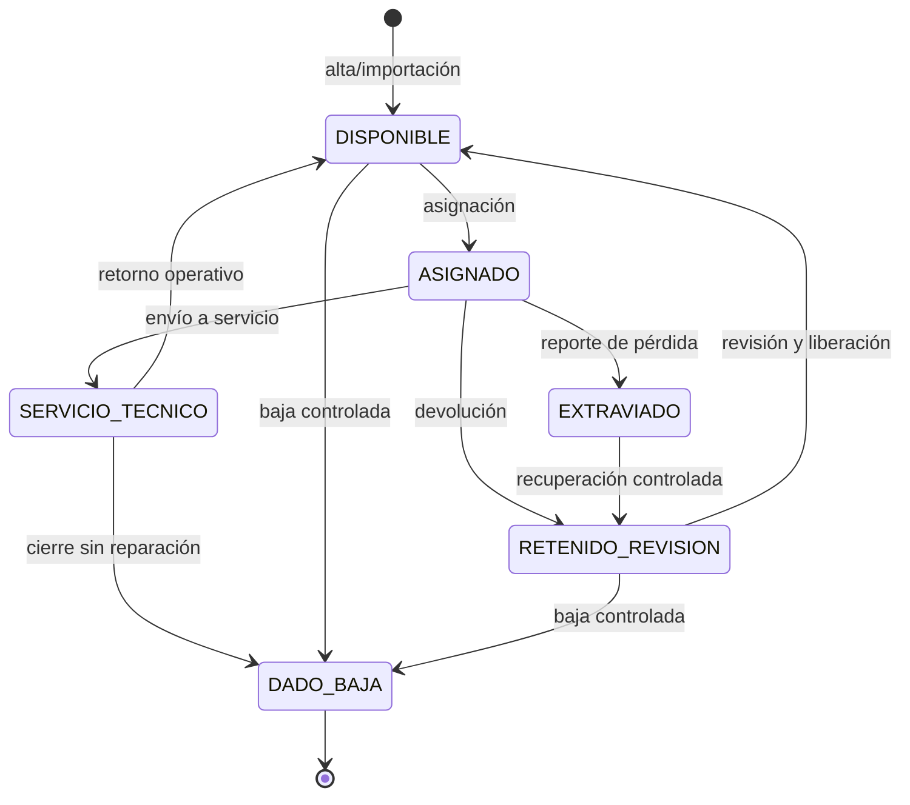

# Ciclo de vida del activo

**Actualizado:** 23 de septiembre de 2026
**Tipo:** funcional

Los nombres son códigos de estado; la API valida las transiciones y no permite reemplazar una baja o recuperación con un cambio genérico.
