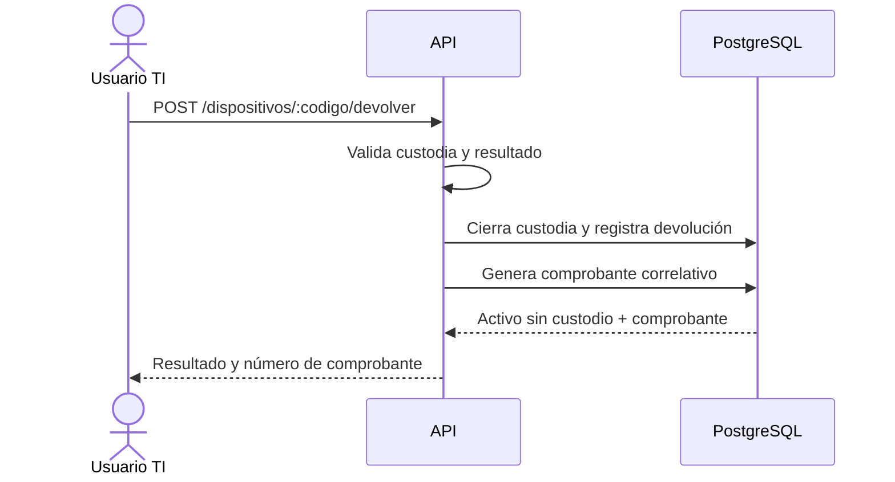

# Flujo de devolución

**Actualizado:** 23 de septiembre de 2026
**Tipo:** funcional

```mermaid
sequenceDiagram
    actor TI as Usuario TI
    participant API as API
    participant DB as PostgreSQL
    TI->>API: POST /dispositivos/:codigo/devolver
    API->>API: Valida custodia y resultado
    API->>DB: Cierra custodia y registra devolución
    API->>DB: Genera comprobante correlativo
    DB-->>API: Activo sin custodio + comprobante
    API-->>TI: Resultado y número de comprobante
```
