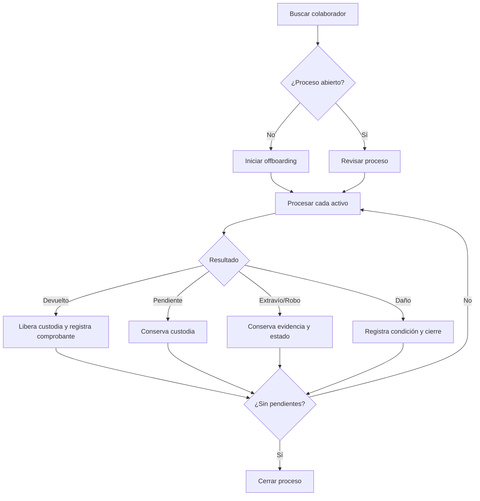

# Flujo de offboarding

**Actualizado:** 23 de septiembre de 2026
**Tipo:** funcional

```mermaid
flowchart TD
    A[Buscar colaborador] --> B{¿Proceso abierto?}
    B -- Sí --> C[Revisar proceso]
    B -- No --> D[Iniciar offboarding]
    D --> E[Procesar cada activo]
    C --> E
    E --> F{Resultado}
    F -->|Devuelto| G[Libera custodia y registra comprobante]
    F -->|Pendiente| H[Conserva custodia]
    F -->|Extravío/Robo| I[Conserva evidencia y estado]
    F -->|Daño| J[Registra condición y cierre]
    G --> K{¿Sin pendientes?}
    H --> K
    I --> K
    J --> K
    K -- No --> E
    K -- Sí --> L[Cerrar proceso]
```
