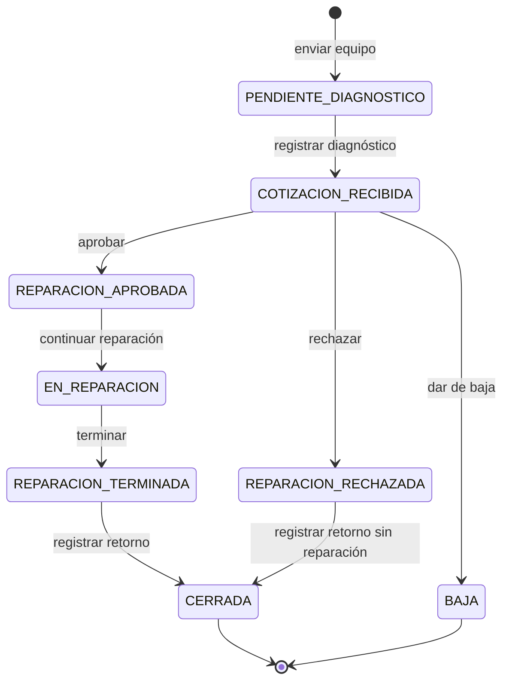

# Flujo de servicio técnico

**Actualizado:** 23 de septiembre de 2026
**Tipo:** funcional

```mermaid
stateDiagram-v2
    [*] --> PENDIENTE_DIAGNOSTICO: enviar equipo
    PENDIENTE_DIAGNOSTICO --> COTIZACION_RECIBIDA: registrar diagnóstico
    COTIZACION_RECIBIDA --> REPARACION_APROBADA: aprobar
    COTIZACION_RECIBIDA --> REPARACION_RECHAZADA: rechazar
    COTIZACION_RECIBIDA --> BAJA: dar de baja
    REPARACION_APROBADA --> EN_REPARACION: continuar reparación
    EN_REPARACION --> REPARACION_TERMINADA: terminar
    REPARACION_TERMINADA --> CERRADA: registrar retorno
    REPARACION_RECHAZADA --> CERRADA: registrar retorno sin reparación
    CERRADA --> [*]
    BAJA --> [*]
```
