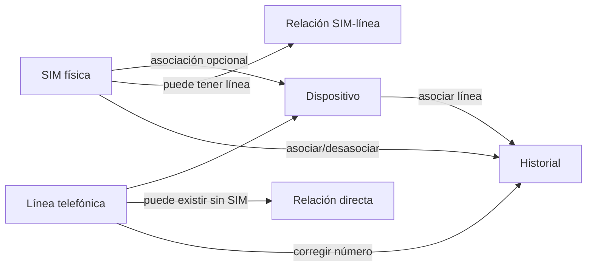

# Flujo de SIM y línea móvil

**Actualizado:** 23 de septiembre de 2026
**Tipo:** funcional

```mermaid
flowchart LR
    SIM[SIM física] -->|asociación opcional| DEV[Dispositivo]
    LINEA[Línea telefónica] --> DEV
    LINEA -->|puede existir sin SIM| DIRECTA[Relación directa]
    SIM -->|puede tener línea| SL[Relación SIM-línea]
    DEV -->|asociar línea| H[Historial]
    SIM -->|asociar/desasociar| H
    LINEA -->|corregir número| H
```

Registrar una línea no equivale a verificar físicamente el equipo.
