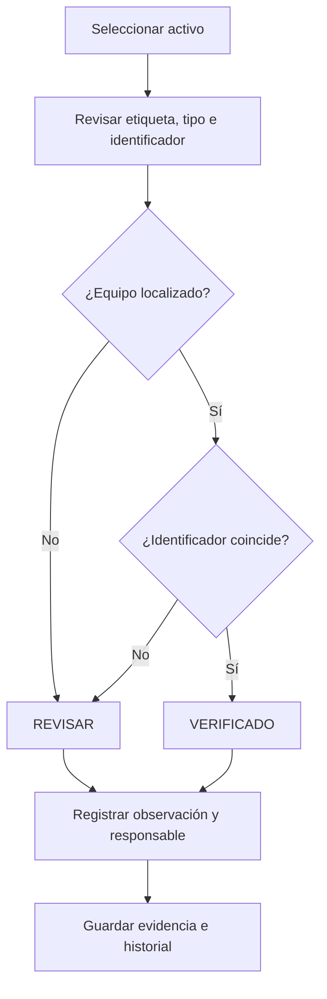

# Flujo de verificación física

**Actualizado:** 23 de septiembre de 2026
**Tipo:** funcional

```mermaid
flowchart TD
    A[Seleccionar activo] --> B[Revisar etiqueta, tipo e identificador]
    B --> C{¿Equipo localizado?}
    C -- No --> R[REVISAR]
    C -- Sí --> D{¿Identificador coincide?}
    D -- Sí --> V[VERIFICADO]
    D -- No --> R
    R --> E[Registrar observación y responsable]
    V --> E
    E --> H[Guardar evidencia e historial]
```
