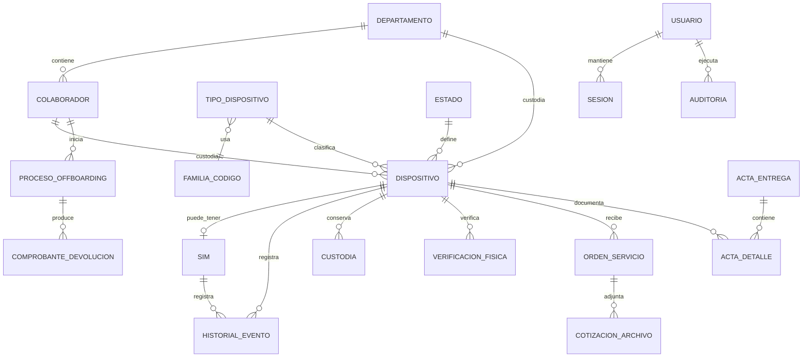

# Modelo de relaciones

**Actualizado:** 23 de septiembre de 2026
**Tipo:** técnico

El diagrama representa relaciones de dominio; los nombres físicos exactos y restricciones se mantienen en `database/migrations`.
