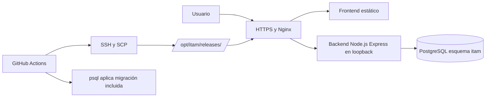

# Informacion del Servidor e Infraestructura

## Alcance y criterio de evidencia

Este documento separa datos comprobados en el repositorio o en una sesión autorizada de los datos que requieren acceso de solo lectura al servidor, consola cloud o administrador responsable. No contiene contraseñas, tokens, PIN, hashes, llaves privadas ni valores de variables secretas.

## Datos observados

| Dato | Valor observado | Estado | Evidencia |
| --- | --- | --- | --- |
| Proveedor | AWS por workflow de despliegue y host de sesión | Confirmado parcialmente | `.github/workflows/cd.yml` y sesión autorizada |
| Host público observado | `34.193.75.49` | Confirmado en la fecha de evidencia | `curl https://checkip.amazonaws.com` |
| Hostname interno | `ip-172-26-14-137` | Confirmado en la sesión | Prompt de shell autorizado |
| Usuario operativo observado | `ubuntu` | Confirmado en la sesión | Prompt de shell autorizado |
| Proceso backend | `/opt/itam/releases/d98da12/backend/dist/server.js` en la evidencia histórica | Confirmado para esa evidencia | Captura de `htop` |
| Runtime de release | Node.js 24 en CI/CD | Confirmado | `.github/workflows/ci.yml` y `cd.yml` |
| Puerto interno esperado | `3000` | Confirmado en código | `backend/src/config/env.ts` y health check |
| Ruta de releases | `/opt/itam/releases/<release>` | Confirmado en CD | `.github/workflows/cd.yml` |
| Frontend desplegado | `/opt/itam/releases/<release>/frontend-dist` | Confirmado en CD | workflow de despliegue |

La evidencia histórica del proceso `d98da12` no debe presentarse como estado actual: el commit auditado de esta entrega es `754d036`. El workflow actual empaqueta la migración 036.

## Arquitectura de despliegue

El diagrama representa lo que el workflow y el código soportan. La existencia y configuración real de Nginx, TLS, firewall y PostgreSQL en producción deben verificarse en el servidor.

## Proceso de publicación

1. CI instala dependencias y compila backend y frontend.
2. CD toma el SHA validado de `main`.
3. Se empaquetan backend compilado, dependencias, frontend estático y la migración 036.
4. SSH y SCP transfieren los artefactos al host configurado por secretos.
5. Se crea `/opt/itam/releases/<release>` y se conserva el `.env` del release anterior.
6. Se ejecuta `npm ci --omit=dev` y `psql` con `ON_ERROR_STOP=1`.
7. PM2 inicia el backend nuevo y se valida `/api/v1/health` por loopback.
8. Se respalda la configuración Nginx, se cambia el root del frontend, se ejecuta `nginx -t` y se recarga Nginx.
9. Si falla el health check o Nginx, el workflow restaura el backend y la configuración anterior.

## Pendientes críticos de servidor

| Dato pendiente | Por qué no se pudo validar | Evidencia necesaria | Responsable | Riesgo |
| --- | --- | --- | --- | --- |
| Región y tipo de instancia | No aparecen en el repositorio ni en la sesión observada | Consola AWS o inventario autorizado | Administrador AWS | Medio |
| Dominio y DNS | Solo se observó una IP pública | Consulta DNS y zona administrada | Administrador DNS | Alto |
| Distribución exacta de Linux | El prompt indica `ubuntu`, no versión | `cat /etc/os-release` en lectura | Operaciones TI | Medio |
| Configuración Nginx | El CD solo prueba y modifica el archivo remoto | `sudo nginx -T` sin secretos | Operaciones TI | Alto |
| PM2 y servicios activos | Se conoce el comando del workflow, no el estado actual | `pm2 jlist`, `systemctl status` | Operaciones TI | Alto |
| PostgreSQL productivo | El endpoint existe, pero no se consultó producción | Health check autorizado y versión sin credenciales | DBA | Alto |
| HTTPS y certificados | No se vio certificado ni renovación | `certbot certificates`, expiración y timer | Operaciones TI | Alto |
| Firewall y puertos | No se observó Security Group ni firewall del host | Consola AWS, `ss -lntp`, reglas autorizadas | Administrador AWS | Alto |
| Backups y restauración | No se observó archivo, retención ni prueba | Inventario y prueba de restauración | DBA / Operaciones TI | Crítico |
| Logs y monitoreo | No se consultaron logs productivos | `pm2 logs` y rotación sin secretos | Operaciones TI | Medio |

## Reinicio, rollback y restauración

El CD implementa reinicio y rollback del backend y de Nginx en el mismo workflow. No existe evidencia de un ensayo productivo de rollback ni de restauración desde backup. Por tanto, el procedimiento está documentado como implementado en código, pero su operación real queda **Pendiente de validar en servidor**.

## Seguridad operativa

Los secretos de Actions se llaman `AWS_HOST`, `AWS_USER`, `AWS_SSH_PRIVATE_KEY`, `AWS_KNOWN_HOSTS` y las variables de base de datos se cargan desde `.env` del release anterior. Los valores nunca deben copiarse a documentación, tickets ni capturas.
