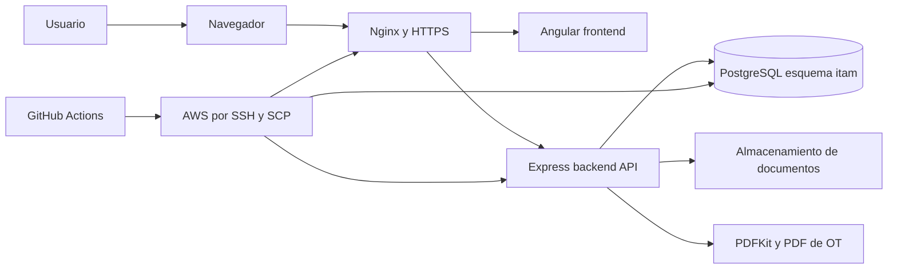
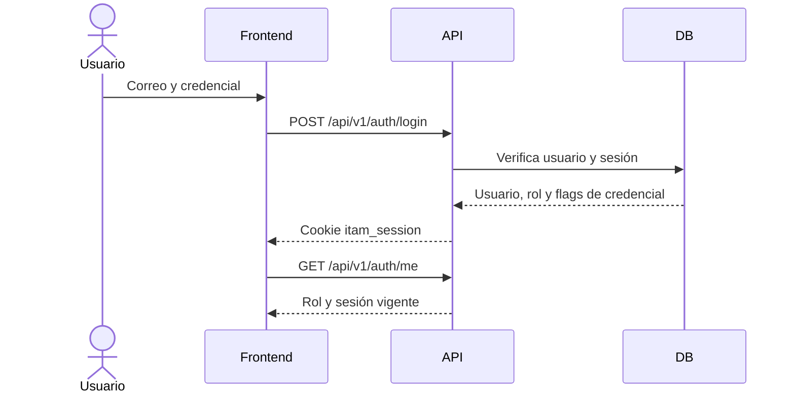
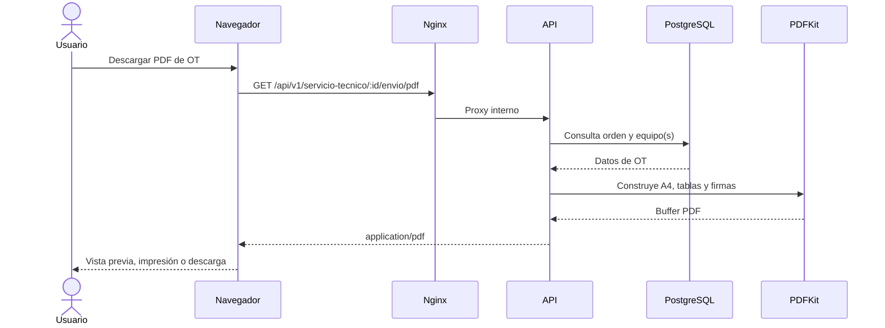
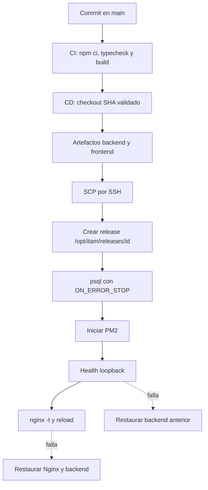

# Esquematico del Sistema

## Vista de componentes

El frontend se sirve como archivos estáticos y usa el backend bajo `/api/v1`. El backend autentica, autoriza, audita, valida reglas de negocio y persiste en PostgreSQL. Los documentos cargados se guardan según `DOCUMENT_STORAGE_PATH`. Los PDF se generan en backend y se devuelven como `application/pdf`.

## Flujo de autenticación

Las sesiones tienen vigencia absoluta e inactividad. El backend revoca una sesión vencida y registra el evento en auditoría.

## Flujo de solicitud y PDF

## Flujo de despliegue

## Backups y recuperación

El workflow respalda la configuración Nginx antes de modificarla y conserva releases anteriores. No hay evidencia en el repositorio de un backup de PostgreSQL ni de una prueba real de restauración. Ambos puntos quedan **Pendiente de validar en servidor**.
