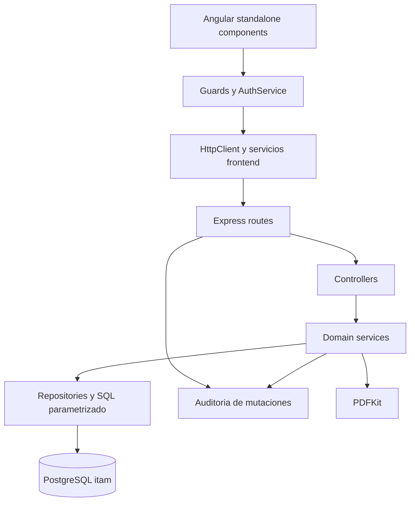

# Arquitectura de la Aplicacion

## Capas

## Backend

`backend/src/app.ts` configura CORS, Helmet, JSON, autenticación, control global de solo lectura y auditoría. Después monta routers por dominio. Los servicios aplican reglas de negocio y los repositorios concentran las consultas. Los errores usan middleware común y respuestas JSON con código HTTP.

## Frontend

Angular usa rutas lazy, componentes standalone, servicios inyectables, formularios reactivos y guards. La vista de servicio técnico mantiene una selección de orden, formularios de edición, diagnóstico y cierre, vista previa PDF y descarga. Las acciones de escritura se ocultan o deshabilitan para `SOLO_LECTURA`, pero la autorización definitiva está en backend.

## Persistencia

PostgreSQL usa el esquema `itam`. Las entidades centrales son usuarios, sesiones, auditoría, departamentos, colaboradores, dispositivos, estados, tipos, familias de códigos, SIM, líneas, historial, órdenes técnicas, cotizaciones, actas, comprobantes, offboarding y verificaciones físicas.

## Seguridad

- Sesión HTTP-only `itam_session` y token almacenado como hash.
- Expiración absoluta e inactividad con actualización controlada.
- `requireAuth` para API protegida.
- `requireRole("SUPER_USUARIO")` para usuarios y operaciones administrativas específicas.
- `rejectReadOnlyMutations` para bloquear mutaciones globales.
- Helmet y CORS con origen explícito.
- Auditoría posterior a mutaciones.
- Secretos solo en variables de entorno o secrets de Actions.

## Generación e impresión

Los PDF se generan en backend con PDFKit. Las órdenes de trabajo usan `buildTechnicalOrderPdf` y soportan una orden principal más equipos adicionales. La plantilla conserva A4, logo, tipografía, tablas blancas con bordes gris claro, casillas, firmas, pie y la sección `RECEPCIÓN Y DEVOLUCIÓN (INTERNO)`. La impresión de etiquetas usa `window.print()` desde el navegador.

## Configuración y dependencias externas

| Dependencia | Uso | Estado |
| --- | --- | --- |
| PostgreSQL | Persistencia y health check | Confirmado en código; estado productivo pendiente |
| Nginx | Proxy HTTPS y frontend estático | Confirmado en CD; configuración real pendiente |
| PM2 | Proceso backend en release | Confirmado en CD; estado actual pendiente |
| AWS | Host de despliegue | Confirmado por workflow; región pendiente |
| GitHub Actions | CI/CD | Confirmado |
| DNS y certificados | Acceso público HTTPS | Pendiente de validar en servidor |

## Decisiones y límites

El repositorio no demuestra por sí solo el estado actual de producción, la cobertura de pruebas, la existencia de backups ni la configuración de firewall. Esos datos deben permanecer diferenciados como pendientes hasta que exista evidencia fechada y autorizada.
